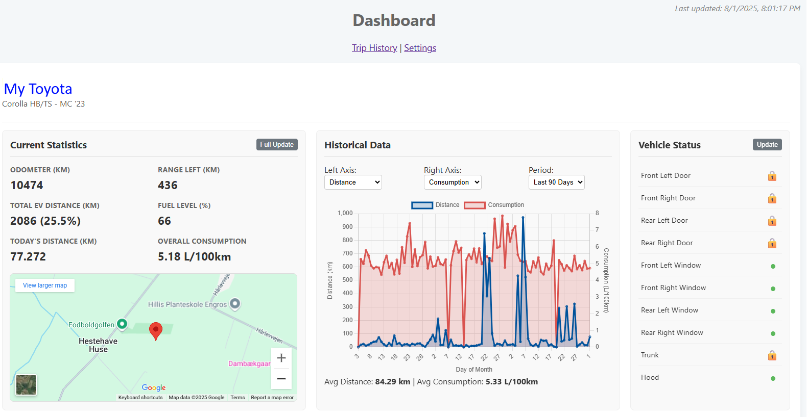
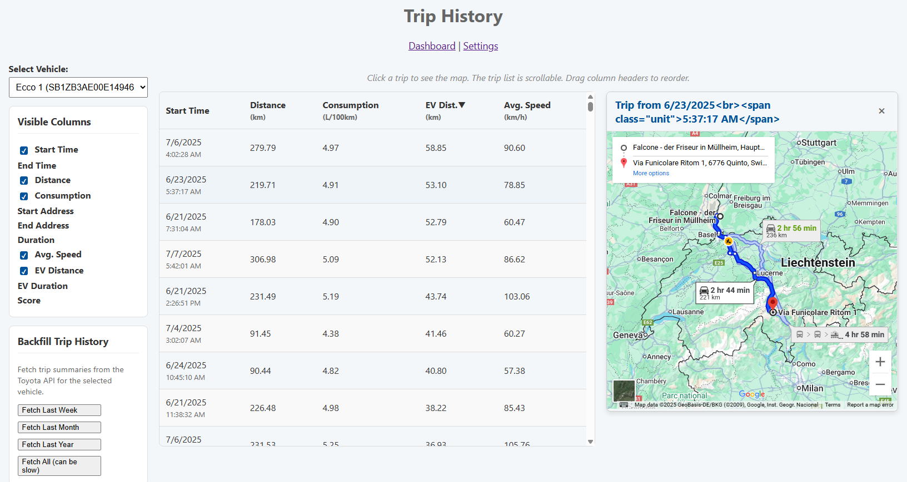

# MyToyota Dashboard

A self-hosted web dashboard to visualize your Toyota vehicle's data, including live status, trip history, and performance statistics.

## Features

*   **Live Dashboard:** View current vehicle stats like odometer, fuel level, range, and location on a map.
*   **Historical Charts:** Interactive charts to track your driving distance, fuel consumption, EV ratio, and more over time.
*   **Detailed Vehicle Status:** A compact, icon-driven panel showing the status of doors, windows, hood, and trunk.
*   **Trip History:** A sortable and filterable table of all your trips, with an integrated map view for each route.
*   **Data Import & Backfill:** Import trip history from a CSV file exported from the Toyota app, or backfill historical data directly from the Toyota API.
*   **MQTT Integration:** Push live vehicle data to an MQTT broker for integration with home automation systems like Home Assistant and Domoticz. Includes support for Home Assistant MQTT Auto-Discovery.
*   **Secure Credential Management:** Securely save your MyToyota username and password via the web interface.  Credentials are encrypted on disk.
*   **Configurable Polling:** Set the data refresh schedule to a fixed interval or a specific time of day.
*   **Dynamic Polling API:** Control polling frequency via HTTP POST requests, enabling integration with external systems like Domoticz.
*   **Docker Support:** Easy to deploy and update using Docker and Docker Compose.

## Screenshot



---

## How It Works

The application is built with a Python backend and a vanilla JavaScript frontend.

*   **Backend:** A `FastAPI` server that handles API requests, fetches data from Toyota's servers using the `pytoyoda` library, publishes data to an MQTT broker, and serves the web interface.
*   **Frontend:** A clean HTML, CSS, and JavaScript interface that uses Chart.js for graphing and communicates with the backend via a REST API.
*   **Data Storage:**
    *   **`data/mytoyota.db`**: An SQLite database that stores all historical trip and vehicle reading data.
    *   **`data/vehicle_data.json`**: A cache file holding the latest live data polled from the vehicle to ensure the dashboard loads quickly.
    *   **`data/credentials.json`**: An encrypted file containing your MyToyota credentials.
    *   **`data/secrets.key`**: The encryption key for `credentials.json`.
    *   **`data/mytoyota_config.yaml`**: The base configuration file for the application, including polling schedules and MQTT broker settings.
    *   **`data/user_config.yaml`**: The user-specific configuration file for the application.

All persistent application data is stored within the `data/` directory, making backups and Docker volume management simple.

---

## Installation and Usage

### Docker (Recommended)

Using Docker is the easiest and most reliable way to run the application.

**Prerequisites:**
*   Docker
*   Docker Compose
*   Git

**Steps:**

1.  **Clone the repository:** 
    ```bash
    git clone https://github.com/stone17/mytoyota-dashboard.git
    cd mytoyota-dashboard
    ```

2.  **Build and run the container:** 
    ```bash
    docker-compose up -d --build
    ```
    or with docker version >2
    ```bash
    docker compose up -d --build
    ```

3.  **Access the Dashboard:**
    Open your web browser and navigate to `http://localhost:8000`. 

4.  **First-Time Setup:**
    * Go to the **Settings** page. 
    * Enter your MyToyota username and password in the "Credentials Management" section and click "Save Credentials". 
    * The application will now be able to fetch your vehicle data. 
    * Configure the polling interval. 
    * Optionally, configure the MQTT integration on the Settings page to connect to your home automation system.
    * Go to the **Trip History** page and click *Fetch all* to retrieve your full trip history. 

**Updating the Application:**

To update to the latest version, simply run: 
```bash
git pull
docker-compose up -d --build
```
or with docker version >2
```bash
git pull
docker compose up -d --build
```

### Without Docker (Manual/Development)

**Prerequisites:**
*   Python 3.11+
*   Git

**Steps:**

1.  **Clone the repository** and navigate into the project directory.

2.  **Create and activate a virtual environment:**
    ```bash
    python -m venv venv
    # On Windows
    .\venv\Scripts\activate
    # On macOS/Linux
    source venv/bin/activate
    ```

3.  **Install dependencies:**
    ```bash
    pip install -r requirements.txt
    ```

4.  **Run the application:**
    ```bash
    uvicorn app.main:app --reload
    ```

5.  **Access the Dashboard** at `http://localhost:8000` and complete the first-time setup as described in the Docker instructions.

## Configuration

All application settings can be set in the **Settings** and are stored in the `data/user_config.yaml` file.
The base settings are stored on the `data/mytoyota_config.yaml` file and should not be changed.
 
*   `logging_level`: Set the verbosity of the logs (e.g., `DEBUG`, `INFO`, `WARNING`).
*   `log_history_size`: The number of recent log lines to keep in memory for the web UI.
*   `api_retries`: Number of times to retry a failing API call.
*   `polling`: Configure the data refresh schedule.
    *   `mode`: Can be `interval` (poll every X seconds) or `fixed_time` (poll once per day at a specific time).
    *   `interval_seconds`: The interval for `interval` mode.
    *   `fixed_time`: The time for `fixed_time` mode (e.g., `"07:00"`).

## Dynamic Polling Control via API

The application exposes an API endpoint (`POST /api/settings/polling`) that allows for dynamic control over the data polling schedule. This is particularly useful for integrating with home automation systems to increase the polling frequency only when needed (e.g., when your car is charging) and reduce it at other times to save resources and API calls.

### Example: Integrating with Domoticz

You can create a Lua script in Domoticz to automatically adjust the dashboard's polling rate based on the status of your car charger.

**Prerequisites:**
*   A device in Domoticz representing your car charger (e.g., a switch that is `On` when charging).
*   The `curl` command-line tool must be installed on the system running Domoticz.

**Steps:**

1.  **Create a Lua Event Script:** In Domoticz, navigate to **Setup -> More Options -> Events** and create a new **Lua** script with the **Device** event type.

2.  **Add the Script Logic:** Paste the following code into the script editor.

    ```lua
    -- script_device_dashboard_polling.lua
    -- This script dynamically changes the mytoyota-dashboard polling rate
    -- based on the status of a car charger device.

    -- =========================================================================
    -- =====                USER CONFIGURATION - CHANGE THIS!                =====
    -- =========================================================================

    -- The IP address or hostname of your dashboard application
    local dashboard_ip = "192.168.1.123" 

    -- The port your dashboard is running on (default is 8000)
    local dashboard_port = "8000"

    -- The EXACT name of your car charger switch device in Domoticz
    local charger_device_name = "Car Charger" 

    -- The polling interval in seconds when charging IS active
    local high_frequency_interval = 300 -- 5 minutes

    -- The polling interval in seconds when charging IS NOT active
    local normal_frequency_interval = 3600 -- 1 hour

    -- =========================================================================
    -- =====                      SCRIPT LOGIC - NO NEED TO EDIT             =====
    -- =========================================================================

    commandArray = {}

    -- Check if the device that changed is the one we care about
    if devicechanged then
        if devicechanged[charger_device_name] then

            -- Construct the base URL for the API endpoint
            local url = string.format("http://%s:%s/api/settings/polling", dashboard_ip, dashboard_port)
            local curl_command

            -- If the charger was turned ON
            if devicechanged[charger_device_name] == 'On' then
                print(string.format("Car charging started. Setting dashboard polling to %d seconds.", high_frequency_interval))
                
                -- Construct the curl command to set the high-frequency interval
                curl_command = string.format(
                    "curl --silent -X POST -H 'Content-Type: application/json' -d '{\"mode\": \"interval\", \"interval_seconds\": %d}' %s",
                    high_frequency_interval,
                    url
                )

            -- If the charger was turned OFF
            elseif devicechanged[charger_device_name] == 'Off' then
                print(string.format("Car charging stopped. Resetting dashboard polling to %d seconds.", normal_frequency_interval))
                
                -- Construct the curl command to set the normal (slower) interval
                curl_command = string.format(
                    "curl --silent -X POST -H 'Content-Type: application/json' -d '{\"mode\": \"interval\", \"interval_seconds\": %d}' %s",
                    normal_frequency_interval,
                    url
                )
            end

            -- If a command was constructed, execute it immediately.
            -- os.execute() is blocking, but for a quick local network call, it's reliable.
            if curl_command then
                os.execute(curl_command)
            end
        end
    end

    return commandArray
    ```

3.  **Customize and Save:**
    *   Update the variables in the `USER CONFIGURATION` section of the script to match your setup (dashboard IP, charger device name, etc.).
    *   Save and enable the script.

Now, whenever your charger device turns on or off in Domoticz, it will send a request to the dashboard to update its polling interval accordingly.

## Using MQTT with Domoticz

Here’s how to get your vehicle’s sensors to appear automatically in Domoticz.

### Step 1: Add MQTT Hardware in Domoticz

1.  In the Domoticz web interface, navigate to Setup -> Hardware.
2.  Add a new hardware device with the following settings:
    * Type: MQTT Auto Discovery Client Gateway with LAN interface
    * Name: Give it a descriptive name, like Toyota MQTT.
    * Remote Address / Port: The IP address and port of your MQTT broker.
    * Username / Password: The credentials for your MQTT broker, if required.
    * Auto Discovery Prefix: Set this to homeassistant. This is the standard prefix the dashboard uses for discovery messages.

### Step 2: Configure the Dashboard

1.  In the MyToyota Dashboard, navigate to the Settings page.
2.  Fill out the MQTT Settings section, making sure the details exactly match what you entered in Domoticz.
3.  Ensure Enable MQTT is checked.
4.  Set the Auto Discovery Prefix to homeassistant.
5.  Click Save MQTT Settings.

### Step 3: See Your Devices

1.  Restart the MyToyota Dashboard application or trigger a manual data fetch from the main dashboard page. This will send the discovery messages to Domoticz.
2.  In Domoticz, navigate to Setup -> Devices.
3.  Your new vehicle sensors (Odometer, Fuel Level, etc.) will appear in the list.
4.  Click the green circular arrow next to each new device to add it. Once added, the device can be used in your floorplans, notifications, and scripts.