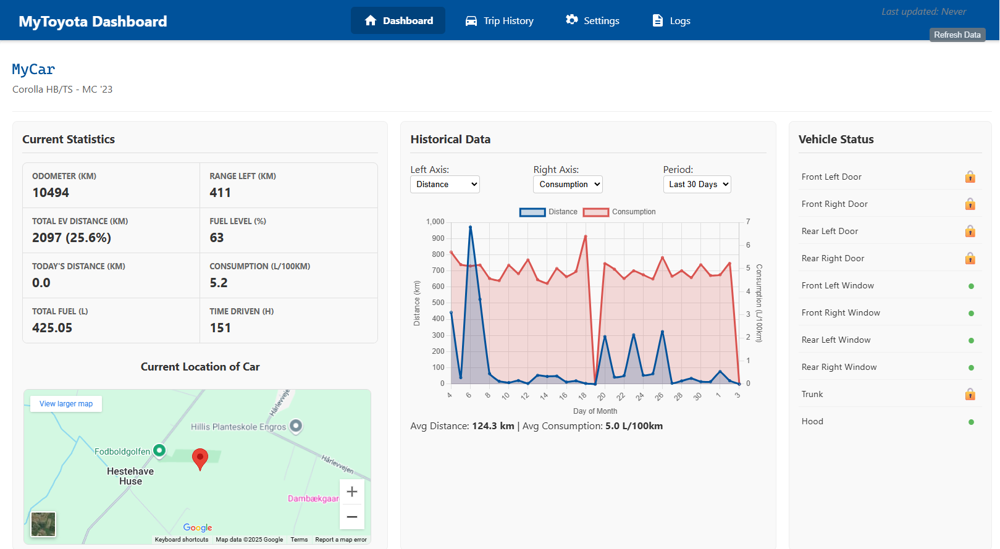
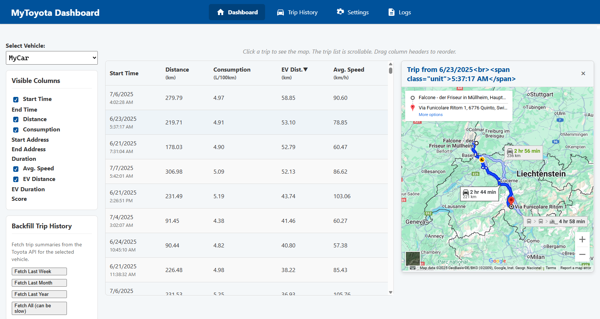

# MyToyota Dashboard

A self-hosted web dashboard to visualize your Toyota vehicle's data, including live status, trip history, and performance statistics.

## Features

*   **Live Dashboard:** View current vehicle stats like odometer, fuel level, range, and location on a map.
*   **Historical Charts:** Interactive charts to track your driving distance, fuel consumption, EV ratio, and more over time.
*   **Detailed Vehicle Status:** A compact, icon-driven panel showing the status of doors, windows, hood, and trunk.
*   **Trip History:** A sortable and filterable table of all your trips, with an integrated map view for each route.
*   **Data Import & Backfill:** Import trip history from a CSV file exported from the Toyota app, or backfill historical data directly from the Toyota API.
*   **Secure Credential Management:** Securely save your MyToyota username and password via the web interface. Credentials are encrypted on disk.
*   **Configurable Polling:** Set the data refresh schedule to a fixed interval or a specific time of day.
*   **Docker Support:** Easy to deploy and update using Docker and Docker Compose.

## Screenshot



---

## How It Works

The application is built with a Python backend and a vanilla JavaScript frontend.

*   **Backend:** A `FastAPI` server that handles API requests, fetches data from Toyota's servers using the `pytoyoda` library, and serves the web interface.
*   **Frontend:** A clean HTML, CSS, and JavaScript interface that uses Chart.js for graphing and communicates with the backend via a REST API.
*   **Data Storage:**
    *   **`data/mytoyota.db`**: An SQLite database that stores all historical trip and vehicle reading data.
    *   **`data/vehicle_data.json`**: A cache file holding the latest live data polled from the vehicle to ensure the dashboard loads quickly.
    *   **`data/credentials.json`**: An encrypted file containing your MyToyota credentials.
    *   **`data/secrets.key`**: The encryption key for `credentials.json`.
    *   **`data/mytoyota_config.yaml`**: The main configuration file for the application.

All persistent application data is stored within the `data/` directory, making backups and Docker volume management simple.

---

## Installation and Usage

### Docker (Recommended)

Using Docker is the easiest and most reliable way to run the application.

**Prerequisites:**
*   Docker
*   Docker Compose
*   Git

**Steps:**

1.  **Clone the repository:**
    ```bash
    git clone <repository_url>
    cd mytoyota-dashboard # Or your project's folder name
    ```

2.  **Build and run the container:**
    ```bash
    docker-compose up -d --build
    ```

34.  **Access the Dashboard:**
    Open your web browser and navigate to `http://localhost:8000`.

4.  **First-Time Setup:**
    *   Go to the **Settings** page.
    *   Enter your MyToyota username and password in the "Credentials Management" section and click "Save Credentials".
    *   The application will now be able to fetch your vehicle data.
    *   Configure the polling intervall.
    *   Go to the **Trip History** page and click *Fetch all* to retrieve your full trip history

**Updating the Application:**

To update to the latest version, simply run:
```bash
git pull
docker-compose up -d --build
```

---

### Without Docker (Manual/Development)

**Prerequisites:**
*   Python 3.11+
*   Git

**Steps:**

1.  **Clone the repository** and navigate into the project directory.

2.  **Create and activate a virtual environment:**
    ```bash
    python -m venv venv
    # On Windows
    .\venv\Scripts\activate
    # On macOS/Linux
    source venv/bin/activate
    ```

3.  **Install dependencies:**
    ```bash
    pip install -r requirements.txt
    ```

4.  **Run the application:**
    ```bash
    uvicorn app.main:app --reload
    ```

5.  **Access the Dashboard** at `http://localhost:8000` and complete the first-time setup as described in the Docker instructions.

## Configuration

All application settings can be set in the **Settings** and are stored in the `data/mytoyota_config.yaml` file.

*   `logging_level`: Set the verbosity of the logs (e.g., `DEBUG`, `INFO`, `WARNING`).
*   `log_history_size`: The number of recent log lines to keep in memory for the web UI.
*   `api_retries`: Number of times to retry a failing API call.
*   `polling`: Configure the data refresh schedule.
    *   `mode`: Can be `interval` (poll every X seconds) or `fixed_time` (poll once per day at a specific time).
    *   `interval_seconds`: The interval for `interval` mode.
    *   `fixed_time`: The time for `fixed_time` mode (e.g., `"07:00"`).
